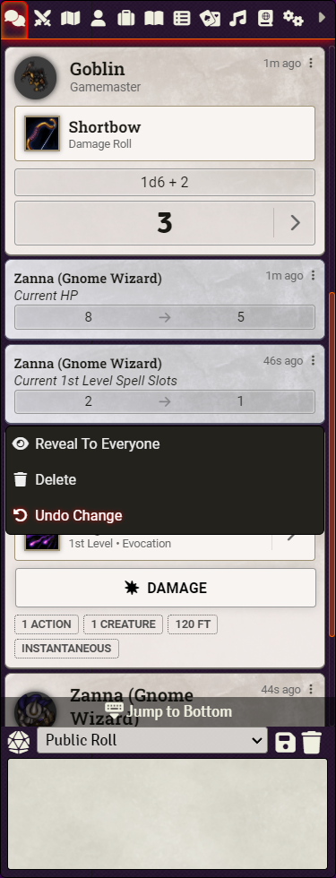
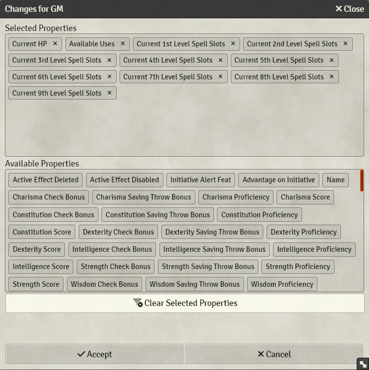

 

# Change Log

A Foundry VTT module to log changes to the chat log.

# Features
- Log changes per property and actor type.
- Show specific changes to the GM, player or everyone.
- Undo changes by right-clicking the chat message.

# Installation

## Method 1
1. In Foundry VTT's **Configuration and Setup** screen, click **Add-on Modules**
2. Click **Install Module**
3. Search for **Change Log** 
4. Click **Install** next to the module listing

## Method 2
1. In Foundry VTT's **Configuration and Setup** screen, click **Add-on Modules**
2. Click **Install Module**
3. In the Manifest URL field, paste: `https://github.com/Larkinabout/fvtt-change-log/releases/latest/download/module.json`
4. Click **Install** next to the pasted Manifest URL

# Supported Systems
Change Log is intended to be system-agnostic, however only the systems listed are currently supported with pre-populated lists and friendly property names:

- [Archmage / 13th Age](https://foundryvtt.com/packages/archmage)
- [Cypher System](https://foundryvtt.com/packages/cyphersystem)
- [D&D 5e](https://foundryvtt.com/packages/dnd5e)
- [Savage Worlds Adventure Edition](https://foundryvtt.com/packages/swade/)

If you would like your system to be supported or a property is not listed for a supported system, please raise a feature request or, better yet, create a pull request.

# How to Use
## For supported systems
1. Open **Configure Settings** and navigate to the **Change Log** settings.
2. Open **Changes for GM**.
3. Click into the **Available Properties** box.
4. Click the properties in **Available Properties** to add them to the **Selected Properties**.
5. Click **Accept**. 
6. Open **Actor Types for GM**.
7. Click the types in **Available Types** to add them to the **Selected Types**.
8. Click **Accept**.
9. Click **Save Changes**

 ## For unsupported systems
 _Please note that unsupported systems have not been tested and the Change Log module may not function as expected._

1. Open **Configure Settings** and navigate to the **Change Log** settings.
2. Open **Changes for GM**.
3. Click into **Selected Properties**.
4. Type the path of the property in dot notation format starting with the type: `actor`, `item` or `activeEffect`. For example, the D&D 5e system has a property for an actor's current HP and the path would be: `actor.system.attributes.hp.value`.
5. Press `;` to add the property to the list.
6. Repeat steps 4 and 5 for each property.
7. Click **Accept**. 
8. Open **Actor Types for GM**.
9. Click into **Selected Types**.
10. Type the id of the actor type. For example, the D&D 5e system has the following actor types: `character`, `npc`, `vehicle`, `group`.
11. Press `;` to add the type to the list.
12. Repeat steps 10 and 11 for each type.
13. Click **Accept**.
14. Click **Save Changes**

## Wishlist
- Log changes to a separate tab/window.
- Group simultaneous changes into one chat card.
- Replace current method of hiding chat messages.
- Allow users to define custom properties to appear in lists and with friendly names.
